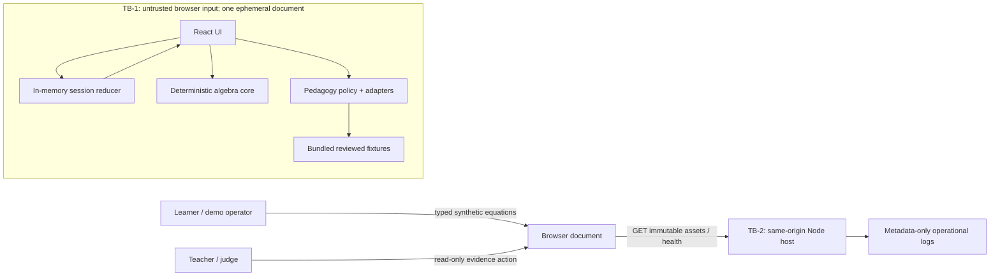

# Architecture — First Wrong Step

## 1. Context, constraints, and architecture outcome

First Wrong Step is a synthetic-only Education-track web application. Its core outcome is a deterministic diagnose → repair → transfer → evidence loop for typed one-variable linear equations. The architecture covers `FR-001`–`FR-012`, `NFR-001`–`NFR-013`, `AC-001`–`AC-032`, and `RISK-001`–`RISK-011` from the frozen product specification `sha256:a7f03221ea6bbf0e2a3ef7c5bcabcefe182e05ad6e8045f53369bb77cdf16018`.

The selected shape is one TypeScript modular monolith and one deployable web artifact:

- a React single-page UI;
- a framework-independent deterministic algebra/domain core executed in the browser;
- in-memory reducer state scoped to one loaded browser document;
- versioned synthetic fixtures and pedagogy semantic contracts bundled at build time;
- a minimal same-origin Node HTTP host for static assets and health only;
- no database, account, authentication, server learner session, state cookie, learner-state API, telemetry SDK, or required external service.

The one-day MVP explicitly ships no real-provider networking, credential, endpoint, pricing/spend ledger, persistent volume, DNS/TLS/redirect client, or provider SDK. Judge mode uses reviewed GPT-5.6 Sol-assisted fixtures plus deterministic fallbacks through a typed `PedagogyAdapter`; failures are simulated by an in-process counted test adapter. Mathematical validity, final-answer correctness, transfer eligibility, and mastery never depend on pedagogy (`BR-006`, `RISK-004`, `RISK-007`). A real provider is future conditional scope requiring a new decision and plan; it is not a hidden MVP task.

Authority assumptions are local writes, reputable packages, synthetic data, and a public deployment only when separately coordinated under the user's existing authorization. No paid API call, account creation, secret creation, or real learner data is part of this architecture task.

## 2. Selected stack and exact verified versions

Versions are pins for the initialization owner; the lockfile must preserve exact transitive resolution. Registry checks were read-only on 2026-07-20. Context Hub maintainer entries were consulted for React, Vite, and TypeScript, then compared with current npm registry metadata. TypeScript remains on the current supported 5.x line because `typescript-eslint@8.64.0` declares `<6.1.0`; TypeScript 7.0.2 was therefore rejected.

| Concern | Exact selection | Verification source (2026-07-20) | Reason |
|---|---|---|---|
| Runtime | Node.js `24.18.0`, npm `11.16.0` | Installed `node --version`, `npm --version` | Available runtime; satisfies all selected engine ranges. |
| UI runtime | `react@19.2.7`, `react-dom@19.2.7` | npm registry; Context Hub maintainer guide confirmed React 19.2 line and matched renderer requirement | Small component model, escaped text rendering, reducer-based local state. |
| Language | `typescript@5.9.3` | Context Hub maintainer entry and npm package metadata | Strict types; compatible with selected lint tooling. |
| Build | `vite@8.1.5`, `@vitejs/plugin-react@6.0.3` | npm registry; Vite engine `^20.19.0 || >=22.12.0`; Context Hub maintainer guide | Fast deterministic browser build without application framework/server-state coupling. |
| Unit/component tests | `vitest@4.1.10` | npm registry; Node engine `^20 || ^22 || >=24` | Shares Vite transforms; deterministic fake clock and module isolation. |
| Browser tests | `@playwright/test@1.61.1` | npm registry; Node engine `>=18` | Two-context, network, keyboard, viewport, trace, screenshot, and timing evidence. |
| Accessibility scan | `@axe-core/playwright@4.12.1` | npm registry | Automated serious/critical WCAG regression floor, supplemented by keyboard/semantic review. |
| Static analysis | `eslint@10.7.0`, `typescript-eslint@8.64.0` | npm registry; peer range includes ESLint 10 and TypeScript `<6.1.0` | Typed linting with no source mutation in CI. |
| Formatting | `prettier@3.9.5` | npm registry | Reproducible formatting check. |
| Browser type declarations | `@types/react@19.2.17`, `@types/react-dom@19.2.3` | npm registry | Exact compile-time React contracts. |
| Host type declarations | `@types/node@24.13.3` | npm registry, latest 24.x line | Aligns declarations with Node 24 runtime major. |
| Algebra | Project-owned exact rational affine normalizer; native `BigInt` | ECMAScript/Node/browser platform | The bounded grammar is smaller and more auditable than a general CAS; no floating point and no expression evaluation. |
| Production HTTP host | Node `node:http`, `node:fs`, `node:path`, `node:crypto` | Node 24 built-ins | Avoids another runtime dependency; the host serves immutable assets and health only. |

The initialization owner must query the registry again only if these pins cannot be resolved, and any substitution requires a new decision plus architecture review. No CDN scripts are allowed.

## 3. System context and trust boundaries



Trust boundaries:

- **TB-1 — user input to deterministic core:** every equation, step, reorder, transfer response, URL, and browser event is untrusted. Lexical and structural limits are checked before normalization. There is no `eval`, dynamic import from user input, HTML injection, or general-purpose CAS parser.
- **TB-2 — browser to host:** only static GET/HEAD and `/healthz` exist and carry no learner state. Every other method/path, including `/api/pedagogy`, is generic `404`/`405`; there is no same-origin mutation/provider endpoint.
- **TB-3 — repository/build supply chain:** package manifests and lockfile are single-owner artifacts; installs use the official registry and exact resolution; lifecycle scripts and audit findings require review.
- **TB-4 — hosting metadata:** the platform/CDN may observe IP, user agent, time, path, and referrer. The product sends `Referrer-Policy: no-referrer`, uses no query state, discloses metadata, and configures the shortest supported retention not exceeding seven days.

Assets are mathematical correctness, learner-entered ephemeral content, derived diagnosis/mastery, reviewed pedagogy, Build Week evidence integrity, and service availability. No provider credential/configuration or production student record exists in MVP.

## 4. Modules and dependency direction

The domain is framework independent. Dependency direction is UI/host adapters → application/domain contracts; domain code cannot import React, Node, networking, storage, fixtures, or external-provider code.

| Module / proposed path | Responsibility | May depend on | Must not depend on |
|---|---|---|---|
| `src/domain/rational.ts` | Canonical reduced rational arithmetic using bounded `BigInt` | platform primitives, budget counter | UI, network, fixtures |
| `src/domain/lexer.ts` | Tokenize the closed grammar while enforcing lexical budgets | limits, domain errors | parser expansion, UI |
| `src/domain/parser.ts` | Parse equation AST with depth/node/work checks | lexer, limits, AST types | dynamic evaluation, pedagogy |
| `src/domain/linearize.ts` | Convert each expression to exact affine pair `(a,b)` | AST, rational, work budget | fixtures, model |
| `src/domain/solution-set.ts` | Classify unique/none/all-real and compare exact sets | affine forms, rational | UI/model |
| `src/domain/analyze.ts` | Stop at first parse/complexity/invalid transition; completion classification | preceding domain modules | pedagogy text |
| `src/domain/misconception.ts` | Produce bounded evidence features and deterministic category where provable; otherwise `unclassified` | AST/analysis types | LLM correctness decisions |
| `src/domain/transfer.ts` | Validate bundled/template transfer candidates and answers | parser/solution-set | pedagogy output as oracle |
| `src/contracts/*` | Closed discriminated unions for analysis, pedagogy, fixtures, state, errors | TypeScript types only | framework code |
| `src/content/*` | Versioned synthetic fixtures, transfer items, semantic contracts, owner-review manifest | contracts | UI state or external provider |
| `src/pedagogy/policy.ts` | Schema, semantic, active-content, link, answer-leakage, length checks | contracts, content contracts | DOM APIs |
| `src/pedagogy/adapters.ts` | Judge fixture and deterministic fallback adapters behind one interface | policy, contracts | networking, credentials, correctness/mastery mutation |
| `tests/pedagogy/failing-adapter.ts` | Test-only counted timeout/invalid/unavailable simulation behind the same interface | contracts, fake clock | production bundle, network, credentials |
| `src/app/session-reducer.ts` | Pure in-memory state machine and ordered attempts | domain/pedagogy contracts | browser persistence APIs |
| `src/app/session-lifetime.ts` | Document epoch, shared abort signal, and synchronous clearing of app-owned learner/evidence refs and caches | state contracts, platform `AbortController` | storage, networking, DOM rendering |
| `src/app/use-cases.ts` | Analyze, correct, transfer, reset orchestration | domain, adapters, reducer actions | server session |
| `src/main.tsx` | Mount the React root and enforce the `pagehide`/persisted-`pageshow` purge/remount boundary | session lifetime, UI root, React DOM root | persistence, history mutation |
| `src/ui/*` | Accessible learner, evidence, provenance views | app selectors/actions | provider/network code, `innerHTML`, local/session storage |
| `server/static-host.ts` | Static files, SPA fallbacks, security headers, `/healthz` | Node built-ins | learner state/domain results |
| `tests/*` | Unit, component, contract, security, benchmark fixtures | public module contracts | production secrets/services |
| `e2e/*` | Visible UI acceptance, isolation, accessibility, network evidence | built app, synthetic fixtures | personal browser profile |

No barrel file may create a reverse dependency from domain into UI/server. `src/contracts` owns shared discriminated unions. The scaffold owner owns manifests, lockfile, TypeScript/Vite/ESLint/Playwright configuration, and host entry point.

## 5. Deterministic algebra design

### 5.1 Closed grammar

```text
equation            := expression "=" expression EOF
expression          := term (("+" | "-") term)*
term                := unary (("*" unary) | ("/" denominator))*
unary               := ("+" | "-") unary | primary
primary             := integer | "x" | "(" expression ")"
denominator         := constantUnary
constantExpression := constantTerm (("+" | "-") constantTerm)*
constantTerm        := constantUnary (("*" constantUnary) | ("/" denominator))*
constantUnary       := ("+" | "-") constantUnary | constantPrimary
constantPrimary     := integer | "(" constantExpression ")"
integer             := ASCII digits, at most 12 digits per literal
```

All binary operators are left-associative; unary signs associate to the right. `*` and `/` bind more tightly than `+` and `-`. A denominator consumes exactly one `constantUnary`: therefore `x / 2 + 3` means `(x / 2) + 3`, `x / -2 * 3` means `(x / (-2)) * 3`, and a multi-operator denominator must be parenthesized, as in `x / (2 + 3)` or `x / (1 / 2)`. The constant grammar contains no `x`; the parser rejects `x / (x + 1)` before affine normalization. The denominator is then evaluated exactly under the same node/work budgets and must be nonzero; `x / (1 - 1)` is a line-specific unsupported zero-denominator error, not a misconception.

Implicit multiplication, decimals, exponentiation, functions, other variables, Unicode look-alike operators, division by an unparenthesized sum, division by an expression containing `x`, division by zero, nonlinear products, and trailing input are unsupported. A rational constant is ordinary left-associative constant division (for example `1 / 2`); it is not a separate lexical token. Whitespace is ignored but counted in the character budgets. Every intermediate value is a reduced exact `Rational { numerator: bigint; denominator: positive bigint }`. Parser contract tests pin the examples above plus nested constant parentheses, repeated division, unary signs, missing parentheses, variable denominators, and zero-valued constant denominators so UI and domain fixtures accept one language.

### 5.2 Budgets and cancellation (`NFR-012`, `BR-015`)

The analyzer receives one problem plus 2–12 steps. Before parse it enforces 256 UTF-16 code units and 128 tokens per equation, 3,072 total equation code units, 12 digits per numeric literal, and parenthesis depth 8. Parser construction enforces 96 syntactic AST nodes per equation and 768 syntactic AST nodes total across the problem and submitted steps. The parser charges exactly one node when constructing each integer, variable, unary-expression, or binary-expression AST node; it updates both the current-equation and analysis counters and returns `too_complex` before constructing a node that would exceed either ceiling or performing affine normalization/expansion. Every token consumption, charged AST node, rational operation, affine combine/multiply/divide, normalization, and solution comparison also charges the instrumented work counter capped at 20,000.

Boundary tests construct public grammar witnesses rather than calling parser internals. Let `W(N)` be `N - 2` unary minus signs followed by `x=0`, which has exactly `N` syntactic AST nodes, `N + 1` tokens and characters, one digit, and depth zero. Contract tests accept `W(96)` and reject `W(97)` specifically at the per-equation node boundary. Total-boundary tests use one problem plus eight submitted steps with node counts `[96, 96, 96, 96, 96, 96, 96, 94, 2]` (768 accepted) and `[96, 96, 96, 96, 96, 96, 96, 95, 2]` (769 rejected); every equation remains at or below 96 nodes, so the latter exercises the total ceiling without a preceding per-equation failure. These cases also assert edit preservation, no pedagogy call, metadata-only logging, and bounded cancellation on rejection.

An injected monotonic clock is checked at deterministic checkpoints; exceeding 500 ms returns a typed `too_complex` result. Tests use a fake clock and work counter. Production uses `performance.now()`. The current editable input remains in reducer state and pedagogy is not invoked. BigInt output is not converted to unbounded decimal strings on the rejection path.

### 5.3 Exact normalization and solution sets (`DEC-002`)

`linearize(expression)` returns `a*x + b` as `{ coefficient: Rational, constant: Rational }`. Multiplication is accepted only if at least one operand has zero `x` coefficient. Division is accepted only by a nonzero constant. Each equation becomes:

```text
dA = left.coefficient - right.coefficient
dB = left.constant - right.constant

dA != 0  -> unique solution x = -dB / dA
dA == 0 and dB == 0 -> all real numbers
dA == 0 and dB != 0 -> no solution
```

Two equations are equivalent iff their tagged solution sets match and, for `unique`, their reduced rationals are exactly equal. No floating-point tolerance is used. The original problem's solution set is the reference. Analysis compares transitions in order and terminates at the earliest parse error, complexity error, or unequal solution set. Every later line receives `not_evaluated`.

A completed unique solution requires the final AST to be isolated syntactically as `x = constant` or `constant = x`, after unary normalization, and the constant must equal the original unique solution. Equivalent but non-isolated equations are valid transitions but `in_progress`. A starting `none` or `all_real` class is a valid terminal boundary: equivalent submitted transitions may be shown valid, but transfer stays unavailable and mastery cannot be awarded.

### 5.4 Misconception evidence and transfer

The invalidity decision is immutable before pedagogy. A deterministic feature extractor compares the two AST/affine structures and may assign one of `distribution`, `combining_like_terms`, `sign_handling`, `inverse_operation`, `division_multiplication`, `equality_preservation`, or `unclassified`. Ambiguous arbitrary input remains `unclassified`; a model may propose a category only when it agrees with allowed evidence and the semantic policy. Seeded fixtures declare the expected category and governing rule, so a swapped or contradictory pedagogy asset is rejected.

Transfer items are bundled by fixture/category or constructed from bounded reviewed integer templates. Before display, the normal parser proves the candidate is supported, has one unique solution, changes at least one coefficient, and carries the same category/skill tag. A transfer answer parses only as a signed rational constant and is compared exactly. Pedagogy text is never read by the transfer validator.

## 6. Typed contracts and state machine

Representative contracts (field names are normative; implementation may split files):

```ts
type Category =
  | "distribution" | "combining_like_terms" | "sign_handling"
  | "inverse_operation" | "division_multiplication"
  | "equality_preservation" | "unclassified";

type SolutionSet =
  | { kind: "unique"; value: RationalText }
  | { kind: "none" }
  | { kind: "all_real" };

type LineDisposition =
  | { kind: "valid"; solutionSet: SolutionSet }
  | { kind: "invalid"; previousIndex: number; currentIndex: number; evidence: MisconceptionEvidence }
  | { kind: "unsupported"; lineIndex: number; code: InputErrorCode; message: string }
  | { kind: "too_complex"; lineIndex?: number; limit: LimitCode; message: "Input too complex—shorten this equation or solution" }
  | { kind: "not_evaluated" };

type AnalysisResult =
  | { kind: "needs_repair"; lines: LineDisposition[]; firstInvalidIndex: number; solutionSet: SolutionSet }
  | { kind: "valid_in_progress"; lines: LineDisposition[]; solutionSet: SolutionSet }
  | { kind: "valid_complete"; lines: LineDisposition[]; solutionSet: { kind: "unique"; value: RationalText } }
  | { kind: "terminal_boundary"; lines: LineDisposition[]; solutionSet: { kind: "none" | "all_real" } }
  | { kind: "input_error"; lines: LineDisposition[] };
```

`RationalText` is a canonical string contract (`-?[0-9]+(/[1-9][0-9]*)?`) used only at serialization boundaries; domain arithmetic uses `BigInt` pairs.

```ts
type Pedagogy = {
  category: Category;
  hint: string;        // <= 280 Unicode code points
  explanation: string; // <= 600 Unicode code points
};

type PedagogyResult = {
  content: Pedagogy;
  provenance: "GPT-5.6-assisted" | "reviewed judge fixture" | "deterministic fallback";
  status: "ready" | "fallback";
  retryable: boolean;
};

type PedagogyAdapterOutcome =
  | { kind: "content"; result: PedagogyResult }
  | { kind: "failure"; code: "timeout" | "invalid_output" | "unavailable"; retryable: boolean };

interface PedagogyAdapter {
  getPedagogy(request: Readonly<PedagogyEvidence>, signal: AbortSignal): Promise<PedagogyAdapterOutcome>;
}
```

The accepted `Pedagogy` object has exactly three own fields. Policy rejects invalid enum, extra/missing keys, URLs, Markdown links/images, HTML-like tags, disallowed control characters, answer leakage, enumerated remaining steps, semantic mismatch, or overlength text. The whole response falls back; fields are never partially merged. React interpolation renders plain text only. In production `JudgeFixtureAdapter` returns reviewed content and `DeterministicFallbackAdapter` returns the reviewed fallback; no production adapter performs I/O. The application maps any typed failure or thrown exception to fallback without changing deterministic analysis.

The memory-only `SessionState` is a discriminated reducer state:

```text
empty -> editing -> analyzing -> needs_repair -> editing -> analyzing
                                  |                         |
                                  +-- fallback/retry -------+
analyzing -> valid_complete -> transfer_ready -> transfer_submitted
analyzing -> terminal_boundary
any nonempty -> reset_confirming -> empty
```

It contains current problem/steps, immutable attempt snapshots, current analysis, pedagogy/provenance, transfer item/response, mastery (`in_progress | needs_practice | mastered`), and view (`learner | evidence | provenance`). It lives only in a top-level `useReducer`. There is no `localStorage`, `sessionStorage`, IndexedDB, Cache API state, cookie, service worker, URL state, BroadcastChannel, process global, or unload persistence. Confirmed reset replaces state synchronously with the constant initial object. Full reload/navigation or context closure creates `empty`; a browser back-forward-cache (BFCache) restoration is also forced through the empty initializer as specified below. A host restart cannot mutate memory in an already-open browser and is not claimed to do so.

`src/main.tsx` installs one capture-phase `pagehide` listener before the initial React mount; it deliberately installs no `unload` or `beforeunload` listener. On every `pagehide`, whether `event.persisted` is true or false, the handler synchronously: (1) marks the root container `hidden` and `inert`; (2) advances the document epoch and aborts the shared request controller so every pending analysis/pedagogy/retry completion becomes stale; (3) clears every registered app-owned learner/evidence ref and cache, including current problem, steps, attempts, diagnosis, hint/provenance, transfer response, mastery, request tokens, and saved focus targets; (4) calls `root.unmount()`, nulls the root reference, and replaces the root container's children so no learner/evidence text or control remains in the frozen DOM; and (5) records only a non-sensitive `purged` boolean and lifecycle event booleans. React dispatch alone is insufficient and is not the purge mechanism. Use cases must not capture raw learner state across an await; async completions must compare both request token and document epoch before any commit.

On `pageshow` with `event.persisted === true`, the controller first asserts `purged`, a null root, an empty root container, and no learner/evidence DOM marker. Any failed assertion repeats the synchronous abort/clear/unmount/DOM purge. It then derives only the initial panel from the unchanged pathname, creates a new constant `empty` reducer and new epoch/controller, and mounts a new React root while the container remains hidden and inert. An initial layout commit verifies the empty-state shape before revealing the container; restored learner, hint, transfer, mastery, focus, and evidence values are never accepted. This defensive remount performs no programmatic focus, matching fresh-load focus behavior. A non-persisted `pageshow` uses the ordinary initial bootstrap and does not double-mount.

Attempt IDs are document-local monotonically increasing integers, not shareable identifiers. Duplicate analyze clicks are disabled while `analyzing`; an application request token prevents a late or repeated result from appending twice.

## 7. Fixture and semantic-content contracts

`fixtures/v1/manifest.json` is public synthetic build input. Each fixture contains an ID, skill tag, starting equation, ordered steps, expected solution-set class, expected first-invalid index or `null`, expected category, governing rule, allowed teaching concepts, forbidden concepts, reviewed pedagogy asset ID, fallback asset ID, transfer item, and review-record ID. It contains no names or user content.

Each pedagogy review record is versioned and records reviewer role (`project owner`), review date, content digest, deterministic evidence digest, and pass/fail for mathematical truth, transition relevance, answer restraint, clarity, and contradiction absence. Shipping requires every item pass all fields (`NFR-013`, `AC-006`, `AC-031`). A negative swapped-rule fixture exists only in tests and must fail the semantic contract suite.

## 8. HTTP boundary and fixture-based pedagogy

### 8.1 Route inventory

| Method/path | Role | State/action | Server behavior |
|---|---|---|---|
| `GET /` | learner/operator | enter learner view | immutable SPA shell, no state |
| `GET /evidence` | teacher/judge | direct entry to read-only evidence | SPA shell initialized to empty evidence because state is document-local |
| `GET /build` | judge | direct entry to Build Week provenance | SPA shell initialized to static content naming Codex, GPT-5.6 Sol ultra, and factory evidence links |
| `GET /healthz` | operator | liveness/readiness | `200` with version/mode; no environment values |
| `POST /api/pedagogy` | none | absent from MVP | generic `404`; no handler, body read, credential, rate key, or side effect |
| all others | anyone | invalid path/method | `404`/`405`; no reflection of path/query |

The client uses a deterministic **panel model**, not a router and not the History API. On document bootstrap, the exact entry pathname selects the initial panel: `/` → learner, `/evidence` → empty evidence, `/build` → build. Any other path is rejected by the host. In-app Learner, Evidence, and Build controls dispatch only `set_view`; they neither call `pushState`/`replaceState` nor change the pathname/hash/query, so they create no browser-history entry and preserve the current reducer state. Every successful switch focuses the destination panel's programmatic `<h1 tabindex="-1">`; returning focuses the learner heading, never a removed trigger. The UI states that reload, explicit address-bar navigation, and Back/Forward that leave the current document discard the ephemeral learning session. The lifecycle purge does not run for these in-app panel switches, so their ordinary state, URL/history, and focus semantics are unchanged.

Because the app creates no history entries, Back always goes to the preceding document-level entry. Before that exit can destroy or BFCache-freeze the document, `pagehide` purges the session and rendered evidence. Forward either constructs a fresh document or receives a persisted BFCache document whose `pageshow` controller remounts from the same pathname with a new empty reducer. Reload follows the same pagehide purge and fresh initial-panel rule. A `popstate` handler is neither registered nor needed. No route contains an object/session identifier. Teacher/judge is a presentation role, not an authenticated privilege: the evidence panel exposes only the active document and has no mutating controls or dispatcher access.

The route Playwright oracle is exact:

| Case | Expected URL/view/state/focus |
|---|---|
| Direct `GET /` | URL remains `/`; learner panel is empty; initial load does not steal focus from the document. |
| Direct `GET /evidence` | URL remains `/evidence`; empty-evidence panel explains no active session; no edit/mutation control exists; initial load does not steal focus. |
| Direct `GET /build` | URL remains `/build`; provenance panel renders; initial load does not steal focus. |
| In-app learner → evidence → learner | Entry URL never changes and `history.length` does not increase; attempts/mastery are identical before/after; each destination `<h1>` owns focus after the switch. |
| In-app learner/evidence → build → learner | Entry URL and reducer evidence remain unchanged; build and learner `<h1>` receive focus in order. |
| Back then Forward after a prior document entry, BFCache used | Back triggers synchronous pagehide purge before the document is frozen; Forward produces `pageshow.persisted === true`, defensively remounts the original pathname with its defined initial panel and an empty reducer, and reveals it only after the empty commit. No prior problem, step, attempt, diagnosis, hint, transfer response, mastery, saved focus target, or evidence DOM/text is recoverable; browser/default document focus applies. |
| Back then Forward after a prior document entry, BFCache not used | Back triggers the same pagehide purge and the document is destroyed; Forward creates the original pathname with its defined initial panel and a fresh empty reducer. No prior learner/evidence value is recoverable and browser/default document focus applies. |
| Reload on each allowed pathname | `pagehide` purges before reload; pathname is preserved, reducer is empty, initial panel derives only from pathname, and no prior attempt/evidence is recoverable. |

The BFCache Playwright suite runs both history directions from each allowed entry pathname: controlled neutral origin → app → Back → Forward, and app → neutral origin → Back. It enters the learner panel without changing the entry URL, creates unique synthetic markers for the problem, step, attempt, diagnosis, hint, transfer, mastery, prior focus, and evidence, then asserts every marker and populated-state control is absent after restoration. A test-only recorder may retain only `pagehide.persisted`, `pageshow.persisted`, and navigation-type booleans; it may not retain UI state or text. Pending timeout/failure and retry cases navigate during the outstanding work and prove abort plus epoch invalidation prevents a late commit. Sequential user A/user B use of one page/history is tested in addition to a separate isolated context. A separate Chromium project launched with `--disable-features=BackForwardCache` proves the non-BFCache fallback. The real-BFCache case passes only after observing both persisted booleans true; if the environment cannot produce that state, the case and privacy gate remain `not-run`, never substituted with reload evidence.

### 8.2 Traversal-safe static host contract

The host never converts an arbitrary URL pathname into a filesystem path. At build time a closed `static-manifest.json` records each public asset URL, project-relative `dist` file, SHA-256, byte size, and MIME from the allowlist (`text/html; charset=utf-8`, JavaScript, CSS, JSON, PNG, WebP, ICO, and trusted build-owned SVG). `index.html` and hashed Vite assets are entries; the manifest itself, source maps, dotfiles, server output, configuration, and sibling files are not. Maximum served file size is 8 MiB and maximum `index.html` size is 512 KiB. Startup fails readiness if an entry is duplicate, absolute, outside `dist`, missing, oversized, has an unknown extension/MIME, is not a regular file, or fails its digest.

For each request the host applies this fixed pipeline before any filesystem call:

1. Accept only GET or HEAD with an origin-form request target of at most 2,048 bytes beginning with one `/`; reject authority form, `//`, fragments, query strings, ASCII controls/NUL, literal backslash, drive/UNC syntax, and malformed percent triplets.
2. Reject case-insensitive encoded slash/backslash/NUL/percent (`%2f`, `%5c`, `%00`, `%25`) before decoding. Decode UTF-8 exactly once with fatal error handling; reject any remaining `%`, backslash/control, non-ASCII path byte, empty interior segment, `.`/`..` segment, dotfile segment, colon, or path not matching `^/[A-Za-z0-9._~/-]*$`. Never normalize a rejected path into acceptance.
3. Match the decoded path either to an exact manifest asset URL or to the exact navigation allowlist `/`, `/evidence`, `/build`. Navigation fallback to manifest-owned `index.html` occurs only for GET/HEAD whose `Accept` includes `text/html`; unknown extensionless paths and asset-like paths are generic `404`, never SPA fallback.
4. At startup, resolve and open the immutable `dist` root once. For every manifest path, walk each component with `lstat` and reject symbolic links/junctions/reparse points, directories at the terminal component, dotfiles, devices/FIFOs/sockets, and special files. `realpath(file)` must equal the root or start with `root + path.sep`; simple string-prefix containment without the separator is invalid. Open the vetted file, then `fstat` the descriptor and serve only the bounded regular file. The packaged root is read-only, preventing post-validation replacement.
5. Send the manifest MIME and `nosniff`; HEAD returns identical status/headers and no body. Navigation HTML (`index.html`, including the three allowlisted fallbacks) uses `Cache-Control: no-store` to avoid reusable HTTP/intermediary copies of the shell, while content-hashed JS/CSS/assets use `Cache-Control: public, max-age=31536000, immutable`. Health and error responses use `Cache-Control: no-store`. These headers are useful HTTP-cache controls but are not a learner-state purge and are never treated as proof that BFCache is disabled. Byte ranges are unsupported and receive `416`; directory listing/index inference is never performed. Every rejection returns a constant-size generic `400`, `404`, `405`, `406`, `413`, or `416` without reflecting or logging the target.

Static-host contract tests cover raw and encoded `../`, `%2e%2e`, mixed/double encoding, `%252e`, encoded/literal slash and backslash, NUL, Windows drive/UNC forms, overlong/invalid UTF-8 targets, sibling-prefix containment, symlink/junction escape at every component, directory/special-file requests, dotfiles, unknown assets, extensionless fallback, queries, ranges, HEAD, and the exact cache policy by response class. Tests prove `/proc`-style paths, environment/config files, server/source output, disabled source maps, the manifest, and a same-prefix sibling root are unreachable; the three allowed navigation paths return only `index.html` under an HTML `Accept`.

### 8.3 MVP pedagogy boundary and failure semantics

Judge mode hard-selects `JudgeFixtureAdapter`; `DeterministicFallbackAdapter` is the only fallback. Both consume the same closed `PedagogyEvidence` type and pass their bundled content through the exact schema/semantic policy before display. `PedagogyEvidence` is an immutable internal object containing fixture ID where applicable, candidate category, governing-rule code, first-invalid index, normalized delta codes, and allowed/forbidden concept codes. It never contains raw equations, final solutions, transfer answers, free text, identity, age, or school data. Nothing serializes it to HTTP in MVP.

The test-only `FailingPedagogyAdapter` is injected directly into application use cases and never included in the production bundle. A fake clock and invocation counter deterministically produce timeout, invalid-output, thrown-unavailable, duplicate-completion, and retry-success outcomes. These simulations prove `AC-015` and the complete fallback → correction → transfer → evidence → reset journey in `AC-032`: fallback provenance is recorded, current work is preserved, attempts are neither lost nor duplicated, and correctness/mastery remain deterministic. Adversarial returned content still passes through the production policy and falls back wholesale.

The Build panel and fixture review manifest make provenance exact: the user created and invoked the Greenfield Software Factory skill through Codex using GPT-5.6 Sol with ultra reasoning; reviewed hint/explanation assets are labeled `GPT-5.6-assisted` or `reviewed judge fixture`; the running public demo does not claim a live call. Dated `.factory` artifacts and content-review digests support the statement (`FR-012`, `AC-006`, `AC-019`, `RISK-009`).

`NFR-009` and `AC-026` are explicitly **conditional and not applicable to this MVP** because no live pedagogy mode, provider invocation, network endpoint, credential, quota/spend setting, source-rate key, or live request identifier exists. The release verification records `AC-026: not-applicable — optional live profile absent` and separately proves absence through route inventory, source/bundle search, environment audit, and outbound-network denial. This disposition does not waive any mandatory judge behavior: `AC-014`, `AC-015`, and `AC-032` remain required and executable through fixtures and the in-process failure adapter.

For the same reason, BATCH-012 `FIND-009` about trusted-proxy derivation is not applicable to the shipped architecture: there is no coarse-source limiter, client-IP resolver, or request accepting forwarding headers. The host ignores forwarding headers for application behavior and logs no raw client address. A future live decision must reopen that finding and select a deployment-specific trusted-source contract before implementation.

A future real-provider feature must begin with a superseding `DEC-###`, new requirements/plan capacity, and a complete security/operations review. It must implement every conditional control in `NFR-009`, `NFR-010`, `BR-012`, and `BR-013`, including a trustworthy coarse-source resolver appropriate to the deployment, credentials, fixed egress/DNS/TLS/redirect/body controls, atomic durable quota/spend accounting, crash recovery, retention, and abuse tests. None of those operations, files, dependencies, tests, configuration, or deployment resources belong to the one-day MVP.

No pagination, export, file upload, webhook, redirect, provider endpoint, or learner-state API exists.

## 9. Threat model and abuse cases

| Threat / asset | Design mitigation | Required verification | Trace |
|---|---|---|---|
| Incorrect equivalence or floating-point drift | Closed grammar, exact reduced rationals, solution-set tags, golden/boundary/property fixtures, no LLM oracle | equivalent-form, unique/none/all-real, repeated-run, mutation tests | `RISK-001`, `RISK-007`, `AC-002`–`AC-005`, `AC-018`, `AC-023` |
| Parser/normalizer CPU or memory exhaustion | closed denominator grammar; preflight chars/tokens/digits/depth; node/work/time budgets; no expansion after rejection | grammar ambiguity/zero-denominator table plus immediately-below/above every limit, forced clock/work budget, huge coefficient/depth cases | `RISK-001`, `RISK-011`, `AC-002`, `AC-004`, `AC-018`, `AC-028` |
| Prompt/content injection and XSS | model receives only enum-coded evidence; exact response keys; URL/markup/control rejection; React escaping; restrictive CSP | adversarial payload and DOM/network tests | `RISK-002`, `AC-007`, `AC-027`, `AC-031` |
| Answer leakage or wrong pedagogy | semantic content records, governing-rule match, forbidden concepts, answer/step policy, owner review, whole-response fallback | golden contracts plus swapped-rule negative fixture | `RISK-002`, `NFR-013`, `AC-006`, `AC-031` |
| Pedagogy unavailable or invalid | production fixture/fallback adapters have no external dependency; counted in-process failures preserve the full journey | clean no-key E2E, policy adversarial suite, and local failure-through-reset matrix | `RISK-002`, `RISK-004`, `AC-014`, `AC-015`, `AC-032` |
| Cross-context or BFCache evidence disclosure/reset | document-memory reducer only; synchronous pagehide abort/ref/cache/root/DOM purge; persisted-pageshow empty remount; no cookie/storage/URL/API/global state; evidence dispatcher excluded | two isolated contexts, sequential shared-history users, real BFCache and forced non-BFCache Back/Forward, pending-work exit, reset/reload/close/reopen, two-origin negative tests | `RISK-006`, `AC-012`, `AC-013`, `AC-025`, `AC-029` |
| Real/minor-related data exposure | synthetic-only notice; no identity fields; no raw-input logs/analytics; no query state/referrer; ≤7-day host metadata | marker log/network/storage audit and hosted configuration audit | `RISK-005`, `AC-017`, `AC-024` |
| Static path traversal/file disclosure | build manifest only, strict one-pass decoding/rejection, symlink-free realpath containment, bounded regular allowlisted files, exact navigation fallback | encoded/double/Windows/symlink/directory/sibling/proc/env/source-map negative table | `RISK-005`, `RISK-006`, `AC-014`, `AC-017`, `AC-024`, `AC-029` |
| Conditional live-provider cost/abuse (`RISK-010`) | eliminated from current attack surface: no endpoint, adapter, credential, source-rate key, request ID, quota, spend, or egress exists; `AC-026` is conditional N/A | route/source/bundle/env/network absence audit; any future live work requires a superseding decision and full conditional gate | `NFR-009`, `RISK-010`, `AC-026` (not applicable) |
| CSRF/CORS/cross-origin mutation | no credential or state-changing/provider route and no CORS response; all POSTs including `/api/pedagogy` are rejected before body processing | cross-origin form/fetch/preflight negative suite plus route inventory | `RISK-006`, `AC-029` |
| Secret/config disclosure | no provider secret is accepted or referenced; no secret uses `VITE_*`; bundle/env/log scans enforce absence | bundle/env/log/source scan and clean no-key start | `NFR-004`, `AC-014`, `AC-017` |
| Clickjacking/content sniffing/referrer leakage | CSP `frame-ancestors 'none'`, `X-Content-Type-Options: nosniff`, `Referrer-Policy: no-referrer` | response-header and embedded-frame tests | `RISK-005`, `RISK-006`, `AC-024`, `AC-029` |
| Supply-chain compromise | exact manifest/lockfile, official registry, lifecycle review, audit/SBOM/secret scan | clean install, lock integrity, dependency/license/security review | architecture gate and final security gate |
| Provenance/overlap misrepresentation | static factual build page tied to dated factory artifacts; no CausalGate import/data/flow | content assertion and repository/submission audit | `RISK-008`, `RISK-009`, `AC-019`, `AC-020` |

Authentication and authorization are intentionally absent because there are no accounts or shared records. This is not presented as a school record system. Adding server-bound learner state is a breaking architecture change requiring a new decision covering real identity, object authorization, secure host-only cookies, CSRF/Origin/Fetch Metadata, restrictive credentialed CORS, retention/deletion, and cross-user negative tests (`NFR-011`).

Security headers on all HTML/health/error responses: a nonce- or hash-based CSP restricted to `'self'` with no `unsafe-inline`, `object-src 'none'`, `base-uri 'none'`, `frame-ancestors 'none'`, `form-action 'self'`, and `connect-src 'self'` (test runner interception verifies no model/provider origin); `Referrer-Policy: no-referrer`; `X-Content-Type-Options: nosniff`; `Permissions-Policy` disabling camera, microphone, geolocation, payment, and interest-cohort equivalents; and HSTS only at the TLS-terminating hosted environment. No third-party fonts/assets/analytics are requested.

## 10. Privacy, retention, storage, and rollback

Learner equations, attempts, diagnosis, hints, transfer response, mastery, and teacher evidence exist only in browser memory for the active document lifetime. They are not written to disk, browser storage, server storage, logs, analytics, traces, URLs, referrers, crash payloads, or backups. Reset is immediate object replacement. Every applicable page lifecycle exit synchronously aborts pending work, invalidates its epoch, clears app-owned learner/evidence references and caches, unmounts the React root, and removes the rendered subtree before either document destruction or BFCache freeze. A persisted `pageshow` exposes only a newly mounted empty state. HTTP cache headers are defense in depth for responses, not the deletion mechanism and not a substitute for lifecycle tests.

Public synthetic content and Build Week evidence are repository-versioned. Operational logs contain only timestamp, service version, route class, status, and duration bucket. They exclude request bodies, query strings, IP, user agent, equation, answer, pedagogy, and adapter output. Platform access logging is minimized/truncated where supported and retained for the shortest supported period no longer than seven days; the privacy notice states unavoidable metadata.

There is no database, schema migration, backup, restore, or user export. Fixture schema changes use an explicit `schemaVersion`; a build-time contract test rejects incompatible manifests. Rollback means deploying the prior immutable image/artifact digest and its matching fixtures. Because learner state is ephemeral, rollback has no data migration and a page reload restarts the session.

## 11. Reliability, observability, and performance

- Deterministic analysis is synchronous behind one UI task boundary and is guarded by the 500 ms/work limits. The reference fixture p95 target is ≤1 second over 100 runs (`NFR-002`, `AC-018`). If future profiling shows main-thread jank, a Web Worker may be introduced without changing domain contracts; it is not required initially.
- Initial usable UI budget is ≤3 seconds at 360×800 and 1440×900 in three cold-cache hosted runs under a documented normal-broadband profile (`AC-022`). Performance budgets: initial compressed JS ≤200 KiB, total initial compressed assets ≤350 KiB, no external font/image dependency, and evidence/build views lazy loaded if necessary.
- Analyze and transfer actions are single-flight in the reducer. Stale async pedagogy results are ignored by request token. No background retry occurs.
- A pedagogy-adapter failure never rolls back deterministic results. A React error boundary offers safe reset without rendering exception/fixture internals.
- `/healthz` returns only `200 { status: "ok", version, mode: "judge" }` after static asset availability; there is no live configuration or provider readiness check.
- The host handles SIGTERM by stopping new static/health connections and closing within ten seconds. Static requests are idempotent and there are no outbound calls to drain.
- JSON structured logs go to stdout. Metrics derived from logs are request count by route class/status and duration buckets only. Browser equation text and adapter content are never sent for correlation.
- No distributed trace vendor or client analytics is used. Local test traces contain synthetic fixtures only.

Capacity assumption is a hackathon demo with low concurrency. The judge artifact can scale horizontally because it has no server state, provider calls, spend journal, or persistent volume.

## 12. UX, route/role/action inventory, and accessibility

| View | Role | Primary actions | Required states |
|---|---|---|---|
| Learner `/` | learner, operator, judge | select one of ≥3 fixtures; enter/edit/add/reorder/remove steps; analyze; inspect first wrong step and hint; retry fallback; correct; submit transfer; open evidence/build; request reset | privacy/empty, editing, loading, unsupported, too-complex, needs-repair, fallback, valid, boundary, transfer-ready, mastered/needs-practice, reset dialog |
| Evidence `/evidence` | teacher/judge, learner | inspect current immutable snapshots; return to learner/build | empty direct-load, analysis/attempt history, provenance, transfer/mastery; no edit or reset action |
| Build `/build` | judge/operator | read provenance and follow available evidence links; return | static content; link-unavailable text when not published |

All roles are labels around the same public, current-document UI; there is no access claim beyond current memory. Evidence components receive read-only selectors, not `dispatch`.

WCAG 2.2 AA design (`NFR-003`, `AC-021`): semantic landmarks/headings/forms/lists/tables; explicit labels and instructions; native buttons; reorder via Move up/Move down buttons (drag is never the only method); visible 3:1 focus indicator; logical DOM/focus order; focus returns to triggering control after reset-dialog cancel and to fixture selection after confirm; `role=status`/`aria-live=polite` for progress/success and `role=alert` for errors; invalid lines use icon/text/index plus color; error summary links/focuses the first affected step; no timed interaction or motion dependency; `prefers-reduced-motion`; 44×44 CSS-pixel primary targets where practical; contrast ≥4.5:1 normal text and ≥3:1 large/non-text UI; page zoom and 200% text do not hide actions.

CSS uses mobile-first grid/flex with `min-width: 0`, wrapping rational/equation display, and no fixed content widths exceeding viewport. Required test viewports are 360×800 and 1440×900 in the current Playwright Chromium. There must be no page-level horizontal scrolling. Automated axe is a floor; keyboard-only and visual checks are mandatory.

MVP copy and equation syntax are English/LTR only; this limitation is visible in project documentation. Human-facing strings are centralized rather than embedded in domain code, and status meaning is carried by semantic text/enums so later localization does not change algebra contracts. No locale-sensitive number parsing or formatting is used.

After initial load, pedagogy and deterministic functions are bundled and require no network. Initial host/network failure uses the browser's normal failure and is not represented as offline-capable/PWA behavior. There is no provider outage, permission prompt, or expired-session state because no live provider, permissions, or session exists.

## 13. Test strategy and acceptance evidence

| Layer | Scope and key criteria | Tool/fixture | Gate evidence |
|---|---|---|---|
| Domain unit | lexer/parser/rational/affine/equivalence, all operators, solution sets, first-error repeat, isolated completion, exact transfer (`AC-002`–`AC-005`, `AC-010`, `AC-011`, `AC-018`, `AC-023`) | Vitest, table/generative bounded fixtures, fake clock/work counter | coverage report and 100-run benchmark |
| Budget/security unit | every immediate boundary, huge/deep input, cancellation, pedagogy schema/content/semantic policy (`AC-007`, `AC-027`, `AC-028`, `AC-031`) | Vitest adversarial corpus and swapped-rule mutation | branch assertions and mutation negative proof |
| Content contract | ≥3 required cases, transfer validation, content digests, owner review fields/provenance (`AC-001`, `AC-006`, `AC-019`) | build-time Vitest manifest audit | versioned manifest/review report |
| Reducer/component | add/edit/reorder/remove, empty/loading/success/errors/fallback/reset, immutable attempt history, evidence read-only (`AC-001`, `AC-008`, `AC-009`, `AC-012`, `AC-013`, `AC-016`) | Vitest + DOM testing utilities selected by scaffold owner | state transition matrix |
| Static-host contract | manifest allowlist, one-pass decoding, containment, symlink/special-file rejection, MIME/size, navigation fallback, HEAD/range and traversal corpus (`AC-014`, `AC-017`, `AC-024`, `AC-029`) | Node test host with disposable roots, sibling/symlink fixtures, raw request targets | exact response/file-open matrix and captured metadata-only logs |
| Pedagogy adapter/failure contract | closed internal evidence, reviewed fixture and fallback, timeout/invalid/unavailable/duplicate/retry simulation, policy rejection, no network (`AC-015`, `AC-017`, `AC-032`) | Vitest in-process counted adapter, fake clock/abort signal, production bundle and network guards | exact invocation/attempt/provenance state matrix and zero outbound requests |
| Conditional live-profile disposition | assert no production live adapter, `/api/pedagogy` handler, credential/config, provider package/origin, quota/spend journal, persistent volume, request/source key, DNS/TLS/redirect code (`NFR-009`, `AC-026`, `RISK-010`) | route/source/bundle/env/container audit | `AC-026` recorded `not-applicable` because optional live precondition is false; absence evidence retained |
| System/E2E | no-key three journeys, distribution repair→transfer→evidence under 180 s, boundary cases, fallback-through-reset (`AC-014`, `AC-023`, `AC-030`, `AC-032`) | Playwright isolated Chromium, outbound model denial | trace/video/screenshots and wall clock |
| Isolation/privacy and routing | two contexts; exact direct loads for `/`, `/evidence`, `/build`; in-panel URL stability/state preservation; synchronous pagehide purge; persisted-pageshow empty remount; real BFCache and forced non-BFCache Back/Forward/reload loss; pending failure/retry invalidation; destination-heading focus; guessed routes; cross-origin mutation; cookies/storage/referrer/network/log marker (`AC-012`, `AC-017`, `AC-021`, `AC-024`, `AC-025`, `AC-029`, `AC-030`) | Playwright current Chromium, two contexts/two local origins, controlled neutral history entry, test-only boolean lifecycle recorder, explicit history/focus assertions, and log capture | route/action/history/focus/lifecycle inventory and negative assertions; BFCache case is `not-run`, never passed by reload substitution, if `pagehide.persisted` and `pageshow.persisted` cannot both be observed true |
| Accessibility/responsive | all controls keyboard-operated; panel-switch destination focus; focus/announcements/semantics/contrast; no horizontal scroll at both viewports (`AC-021`) | Playwright + axe + screenshots + specialist visual review | route/action/viewport coverage |
| Performance | analysis p95 100 runs; three cold-cache hosted usable-UI runs (`AC-018`, `AC-022`) | benchmark + Playwright performance timing | raw samples, median/worst and environment |
| Static/supply chain | typecheck, lint, format, clean build/install, audit, license/SBOM, secret scan, bundle inspection | tsc/ESLint/Prettier/npm/security tools chosen by validator | exact command/version/raw output |
| Provenance/distinctness | factual Codex/GPT-5.6 Sol ultra/factory copy and no CausalGate import/data/flow (`AC-019`, `AC-020`) | content test, repository search, independent manual audit | dated factory/submission evidence |

Tests use synthetic fixtures and no personal browser profile. Browser validation must be delegated to an independent UI-testing worker against one frozen source fingerprint, with route/role/action, state, viewport, browser, accessibility, console/network, and artifact dispositions. Code, test, security, and UI approvals become stale after any source/test/dependency/config mutation.

## 14. Delivery partitions and parallel-safe ownership

The planning worker may refine slice IDs but must preserve these ownership boundaries and dependency direction. Concurrent writers require isolated worktrees; otherwise serialize them. Shared manifests/config/lockfiles have exactly one owner.

| Partition | Exclusive paths | Stable contract / prerequisite | Parallel safety | Integration order |
|---|---|---|---|---|
| Foundation/scaffold | `package*.json`, root configs, `server/static-host.ts`, base `src/main.tsx`, test harness configs | exact pins, scripts, security/cache headers, shared compile settings, lifecycle mount/purge/remount shell | single owner; no parallel manifest writers | first |
| Algebra core | `src/domain/**`, `tests/domain/**` | `src/contracts/domain.ts`; DEC-002 | parallel with fixture/UI work only after contracts frozen | before application |
| Content/pedagogy | `src/content/**`, `src/pedagogy/policy.ts`, content/policy tests | fixture and pedagogy contracts; DEC-004/005 | parallel with algebra if it does not change shared contracts | before use cases |
| Session/application | `src/app/**`, reducer and lifecycle contract tests | frozen domain/pedagogy contracts; DEC-003; document epoch/abort/clear contract | not parallel with UI if shared selectors/actions or lifecycle registrations change | after core/content |
| Learner UI | `src/ui/learner/**`, scoped styles/tests | application actions/selectors | parallel with evidence/build UI on disjoint paths | after app contract |
| Evidence/build UI | `src/ui/evidence/**`, `src/ui/build/**`, scoped tests | read-only selectors and static provenance | parallel with learner UI | after app contract |
| E2E/operations docs | `e2e/**`, deployment assets, public docs as separately assigned | integrated runnable app and frozen route inventory | read-only validation is separate from authored regression tests | last before review |

`src/contracts/**` is a shared integration boundary with one owner per wave. Integration order is scaffold → contracts → domain/content → application → UI → E2E/ops. The test-only failing adapter belongs to the content/pedagogy partition and cannot enter production output. After integration, freeze a fingerprint and run independent code, security, test, and UI review in one batch.

## 15. Deployment and rollback

The production artifact is an immutable OCI image or equivalent package containing Node 24, `server` output, and content-hashed Vite `dist` assets. It listens on injected `PORT`, binds `0.0.0.0` only in the hosted environment, runs as a non-root user on a read-only filesystem with a writable temporary directory only if the platform requires it, and exposes `/healthz`. Local dev binds `127.0.0.1` with strict port selection.

Environments:

- **local/test:** synthetic fixtures plus in-process failing adapter, no provider network/package/config/secret, allowlisted localhost origin;
- **public judge:** reviewed fixture/fallback adapters only, no provider endpoint/credential/quota/spend/persistent volume, no analytics, max host-log retention seven days.

The only public mode is `judge`; a display constant may be compiled in without environment input. Startup accepts no OpenAI/provider key, model, endpoint, proxy, pricing, quota, spend, journal, or live-mode configuration. Environment/source/bundle audits fail if those surfaces appear. The environment example, if retained for the static host port, contains no provider placeholder.

There are no migrations or operational journals. Deployment is health-checked before traffic. Rollback switches traffic to the prior immutable image digest; fixture/content and code roll back together and no persistent state requires reconciliation. Public deployment, DNS, submission, and release remain coordinator/user-authorized external actions, not architecture-worker actions. Enabling a provider is not a rollback/configuration option for this artifact; it requires a separately reviewed future build.

## 16. Decision records

| ID | Decision | Principal trace | Record |
|---|---|---|---|
| `DEC-001` | One TypeScript modular monolith with React/Vite and a minimal Node host | `FR-001`–`FR-012`, `NFR-002`, `NFR-004`, `RISK-004` | `.factory/decisions/DEC-001-modular-typescript-monolith.md` |
| `DEC-002` | Project-owned exact rational affine validator, not an LLM/CAS correctness oracle | `FR-002`–`FR-004`, `FR-007`–`FR-008`, `NFR-001`, `NFR-007`, `NFR-012`, `RISK-001`, `RISK-007`, `RISK-011` | `.factory/decisions/DEC-002-exact-rational-linear-validator.md` |
| `DEC-003` | Browser-document memory is the only learner/evidence state | `FR-006`, `FR-009`, `NFR-005`, `NFR-011`, `RISK-005`, `RISK-006` | `.factory/decisions/DEC-003-memory-only-session-state.md` |
| `DEC-004` | MVP ships fixture/fallback pedagogy only; real-provider operations are future conditional scope | `FR-005`, `FR-010`, `NFR-004`, `NFR-006`, `NFR-009`, `NFR-010`, `RISK-002`, `RISK-004`, `RISK-010` | `.factory/decisions/DEC-004-bounded-pedagogy-adapters.md` |
| `DEC-005` | Versioned semantic contracts and deterministic transfer fixtures gate shipped content | `FR-005`, `FR-007`, `FR-010`, `NFR-013`, `RISK-002`, `RISK-003` | `.factory/decisions/DEC-005-reviewed-semantic-fixtures.md` |
| `DEC-006` | One immutable deployment with no database and digest rollback | `NFR-002`, `NFR-004`–`NFR-006`, `RISK-004`, `RISK-005`, `RISK-010` | `.factory/decisions/DEC-006-stateless-deployment-and-rollback.md` |

## 17. Traceability disposition

Every frozen requirement, acceptance criterion, and risk has an architectural home:

| Architecture area | Requirements | Acceptance | Risks |
|---|---|---|---|
| Exact algebra, limits, completion, transfer | `FR-002`–`FR-004`, `FR-007`–`FR-008`; `NFR-001`, `NFR-002`, `NFR-007`, `NFR-012` | `AC-002`–`AC-005`, `AC-010`–`AC-011`, `AC-018`, `AC-023`, `AC-028` | `RISK-001`, `RISK-003`, `RISK-007`, `RISK-011` |
| Implemented pedagogy/content provenance and failure | `FR-005`, `FR-010`, `FR-012`; `NFR-004`, `NFR-006`, `NFR-010`, `NFR-013` | `AC-006`–`AC-007`, `AC-014`–`AC-015`, `AC-019`–`AC-020`, `AC-027`, `AC-031`–`AC-032` | `RISK-002`, `RISK-004`, `RISK-008`, `RISK-009` |
| Conditional future live provider — absent/N/A in MVP | `NFR-009` (condition false) | `AC-026` (`not-applicable`; absence audit required) | `RISK-010` eliminated from current attack surface; reopens with future live decision |
| UI, attempts, states, evidence, accessibility | `FR-001`, `FR-006`, `FR-009`, `FR-011`; `NFR-003`, `NFR-008` | `AC-001`, `AC-008`–`AC-009`, `AC-012`–`AC-013`, `AC-016`, `AC-021`, `AC-030`, `AC-032` | `RISK-006` |
| Privacy, isolation, hosting | `NFR-004`–`NFR-005`, `NFR-011` | `AC-017`, `AC-024`–`AC-025`, `AC-029` | `RISK-005`, `RISK-006` |
| Operability/performance | `NFR-002`, `NFR-006` | `AC-018`, `AC-022`, `AC-032` | `RISK-004`, `RISK-011` |

Complete frozen-ID inventory covered by this candidate (ranges in the table above are expanded here to remove ambiguity):

- Functional: `FR-001`, `FR-002`, `FR-003`, `FR-004`, `FR-005`, `FR-006`, `FR-007`, `FR-008`, `FR-009`, `FR-010`, `FR-011`, `FR-012`.
- Non-functional: `NFR-001`, `NFR-002`, `NFR-003`, `NFR-004`, `NFR-005`, `NFR-006`, `NFR-007`, `NFR-008`, `NFR-009`, `NFR-010`, `NFR-011`, `NFR-012`, `NFR-013`.
- Acceptance: `AC-001`, `AC-002`, `AC-003`, `AC-004`, `AC-005`, `AC-006`, `AC-007`, `AC-008`, `AC-009`, `AC-010`, `AC-011`, `AC-012`, `AC-013`, `AC-014`, `AC-015`, `AC-016`, `AC-017`, `AC-018`, `AC-019`, `AC-020`, `AC-021`, `AC-022`, `AC-023`, `AC-024`, `AC-025`, `AC-026`, `AC-027`, `AC-028`, `AC-029`, `AC-030`, `AC-031`, `AC-032`.
- Risks: `RISK-001`, `RISK-002`, `RISK-003`, `RISK-004`, `RISK-005`, `RISK-006`, `RISK-007`, `RISK-008`, `RISK-009`, `RISK-010`, `RISK-011`.

The architecture candidate is ready for independent completeness, feasibility, security/privacy, testability, and web-UX review against a new SHA-256 snapshot. No architecture gate is claimed here; the coordinator must freeze this artifact and run the required review barrier.
